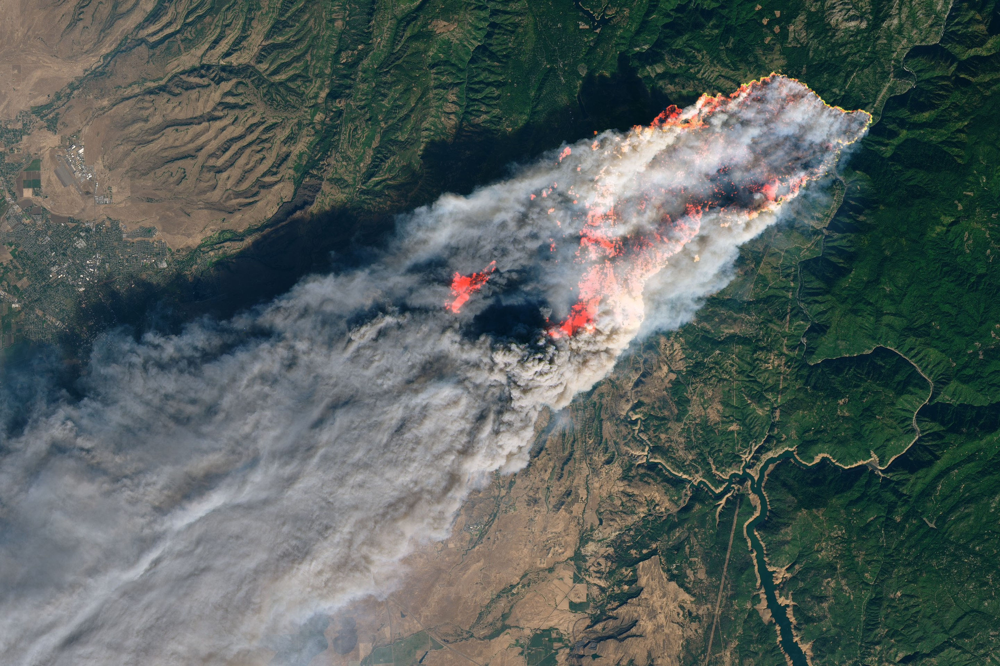
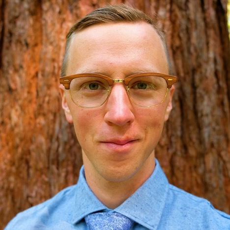

# Welcome to the Citywide Wildfire Evacuation Time Estimation Tool

- Our **mission** is to help communities respond to wildfires by providing resources for planning and mitigation.

## Motivation

#### Camp Fire in Paradise, California, 2018
In November of 2018, the [town of Paradise California was consumed by the Camp Fire](https://en.wikipedia.org/wiki/Camp_Fire_(2018)#Timeline).
  

  
  

  - how long will it take the residents of Paradise, CA to evacuate during a wildfire?
  - how well are roadways connected in Paradise, CA?
  - how resilient are roadways in Paradise, CA to blockages?
  <iframe width="175%" height="500px" src="https://studio.unfolded.ai/public/ae438921-4fd0-471d-9c35-1ae853a8d123/embed" frameborder="0" allowfullscreen></iframe>
  
  
  
## Services
- We help state, local, and federal planners save lives by offering several products:
  - evacuation times
  - roadway connectivity
  - roadway resilience

## Research

## The Team

||
|:--:| 
| Bill has BS, MS and Ph.D. from University of California at Berkeley in Civil and Environmental Engineering with emphasis in Transportation Engineering. Bill extensive experience in analyzing empirical data and evaluating the validity of the findings from transportation simulation studies. Bill expects to graduate from MIDS program in April of 2021. |

||
|:--:| 
| Rajiv has over 2 decades of experience in various leadership roles in financial services. His expertise is in trading and risk systems development. Rajiv expects to graduate from the MIDS program in spring 2021 |

||
|:--:| 
| David is an Assistant Professor at Washington State Univeserity. He helps farmers produce food crops without contributing to environmental degradation with data science tools. Like Bill and Rajiv, David expects to graduate from the MIDS program in April of 2021. |

### Collaborators

## Contact
