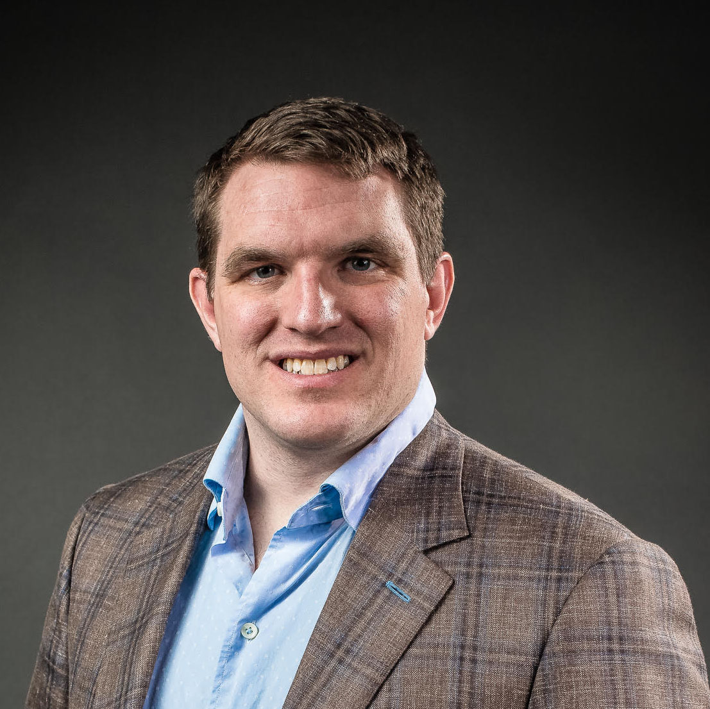
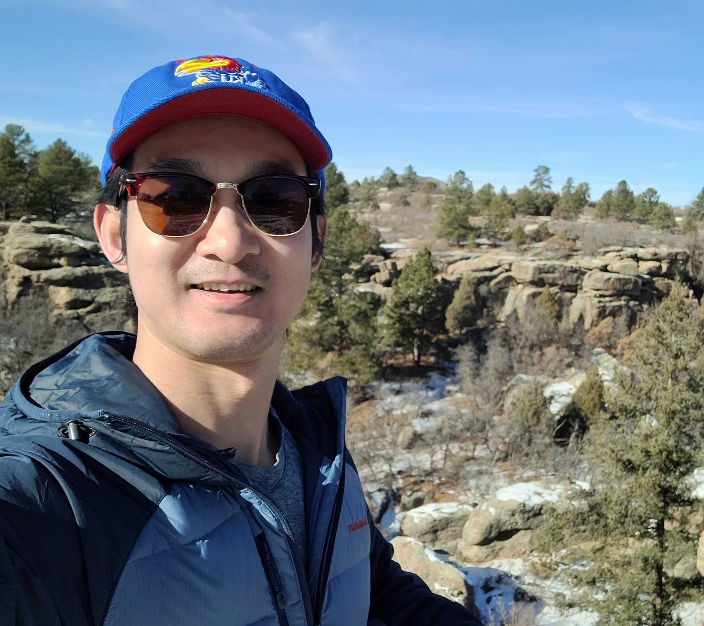
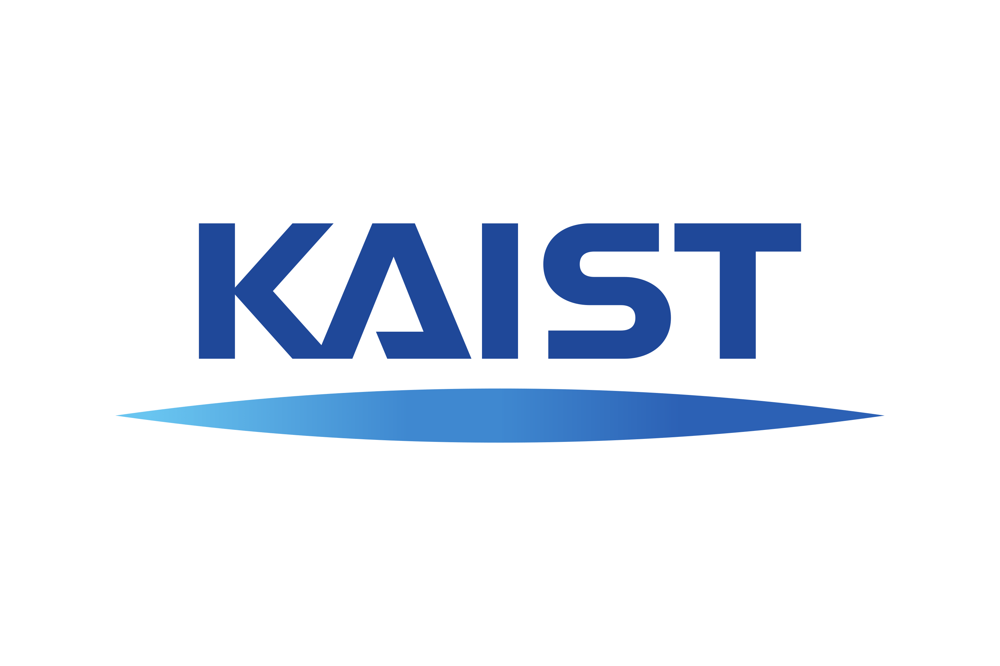

# Welcome to the Citywide Wildfire Evacuation Time Estimation Tool

Our **mission** is to help communities respond to wildfires by providing resources for planning and mitigation.

## Motivation

#### Camp Fire in Paradise, California, 2018
In November of 2018, the [town of Paradise California was consumed by the Camp Fire](https://en.wikipedia.org/wiki/Camp_Fire_(2018)#Timeline).
  

  
  

Since then the [frequency and intensity of wildfires has increased in the United States](https://www.ucsusa.org/resources/climate-change-and-wildfires). To help decision makers across the US make informed decisions about evacuations during wildfires, we have created tools that:
  - estimate the time needed to evacuate a city
  - determine the connectivity of roadways within cities
  - determine the resilience of roadway networks when areas are congested or occluded by obstacles
  
## Services
Evacuation time estimates, connectivity and resiliance metrics are supported by [Unfolded](https://www.unfolded.ai/).
<iframe width="175%" height="550px" src="https://studio.unfolded.ai/public/ae438921-4fd0-471d-9c35-1ae853a8d123/embed" frameborder="0" allowfullscreen></iframe>&nbsp;    
## Research
Currently, research efforts are focused on estimating roadway capacities during wildfire evacuations.

## The Team

||
|:--:| 
| Bill has BS, MS and Ph.D. from University of California at Berkeley in Civil and Environmental Engineering with emphasis in Transportation Engineering. Bill extensive experience in analyzing empirical data and evaluating the validity of the findings from transportation simulation studies. Bill expects to graduate from MIDS program in April of 2021. |

||
|:--:| 
| Rajiv has over 2 decades of experience in various leadership roles in financial services. His expertise is in trading and risk systems development. Rajiv expects to graduate from the MIDS program in spring 2021 |

||
|:--:| 
| David is an Assistant Professor at Washington State University. He helps farmers produce healthy crops with a variety of tools. Like Bill and Rajiv, David expects to graduate from the MIDS program in April of 2021. |

## Collaborators

||
|:--:| 
| Matthew McElhaney has experience as a Director of Technology and as the manager of Data Science and Data Engineering for a major oil company. Matthew implemented solutions including Augmented Reality, IoT, and Real Time Work Assignment/Route Optimization resulting in a 30% reduction in company operating costs. Matthew’s areas of interest include operations research and optimization. Prior to entering industry he served in the United States Army for five years as an infantry officer. |

||
|:--:| 
| Julian is a data analytics engineer at LOS, where he applies machine learning and statistical methods to improve hydraulic fracturing efficiency and safety in oilfields. He is passionate about working on data science projects that help create a better energy future and promote public health. Julian enjoys learning everything about programming, machine learning and AI. He obtained his data analytics training with a MicroMaster certificate from Georgia Institute of Technology. He likes practicing photography, biking and skiing in his spare time. |

||
|:--:| 
| Info about KAIST? |

## Sponsors 

## Contact
 
